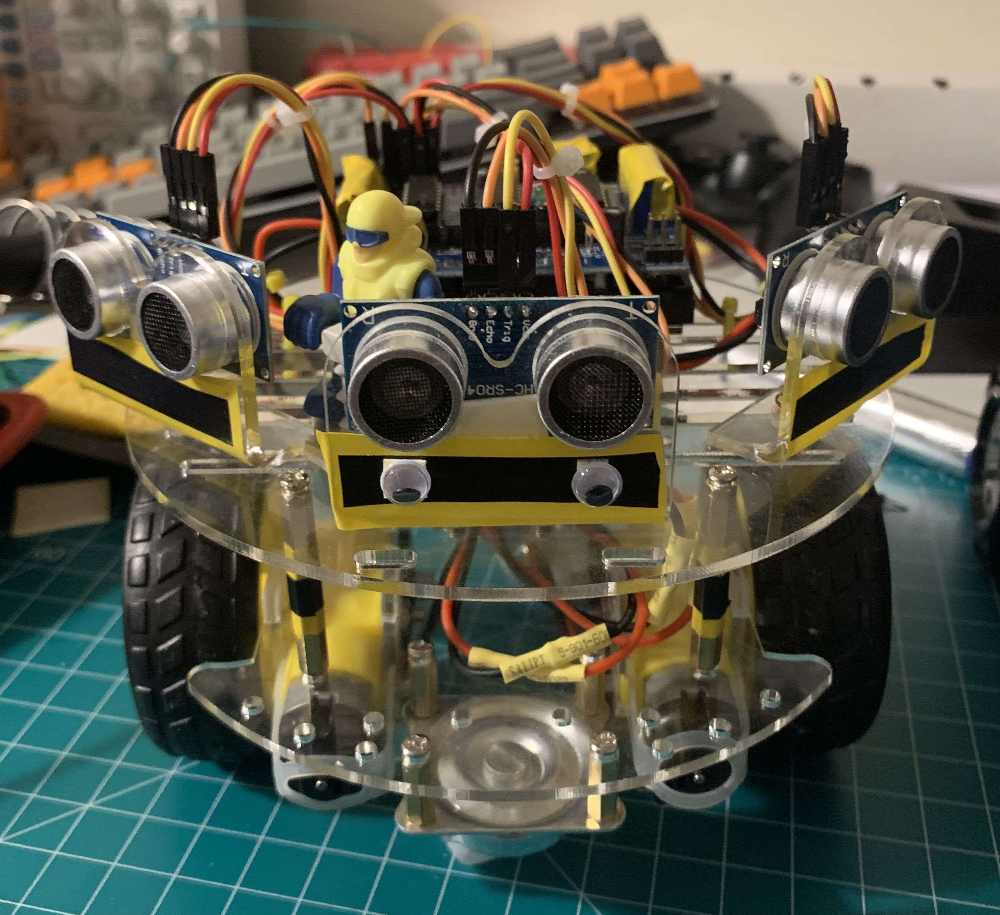
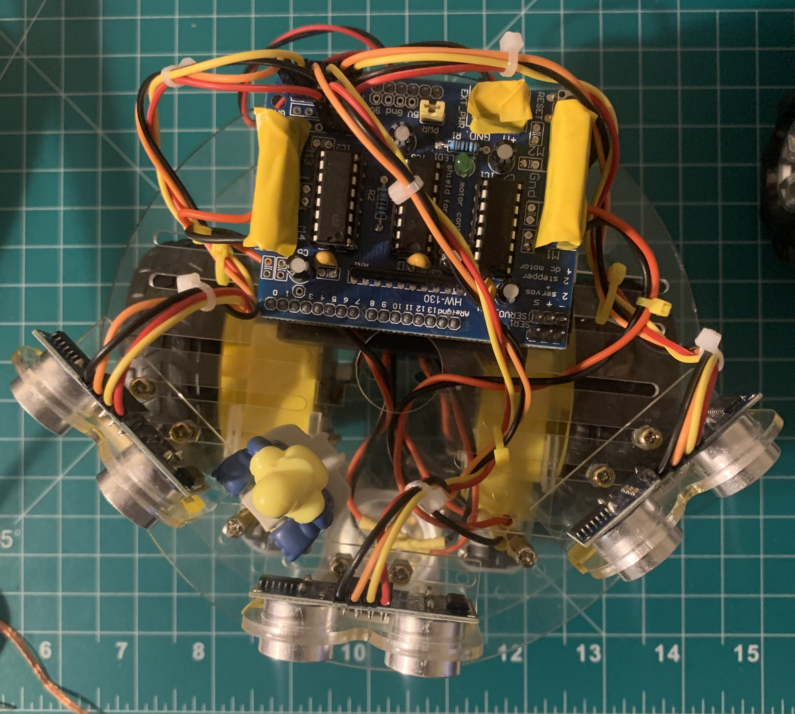
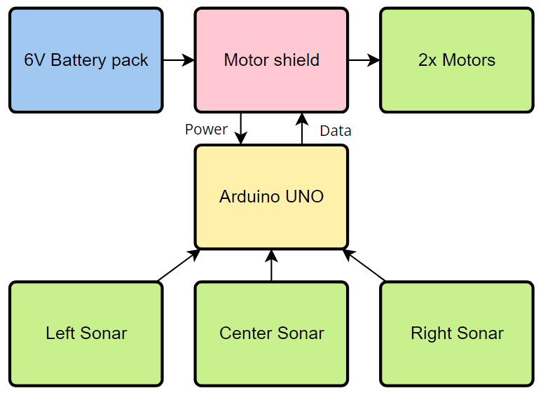

# pancake-robot
Low-cost differential robot with basic object avoidance on the Arduino.

pancake is an object avoidance robot that utilizes three front sonars to measure the distances and choose a path based on these distances. The robot itself is meant to be low cost and the idea came from my stash of spare parts. The object avoidance is very simple, the sonar distances are constantly being measured and if any of the three goes below a certain threshold (too close to an object) then it will steer away from that object. i.e. if the left side is close to the wall, then it will go backwards and rotate to the right away from the wall. Note that distances travelled and the rotation is based on time and will vary depending on the environment. An encoder on each of the wheels could account for this but is not within the scope of the project so it has been neglected.

| pancake | pancake Top View |
|:--------:|:-----------------:|
|||

### Parts List

- 2-wheel drive chassis
- 2x TT motors
- Arduino
- Arduino motor shield
- Battery pack (6V)
- 3x sonar
- Various harnessing

Total is about ~$40 or ~$25 without the Arduino but only ~$10 was spent due to having spare parts on hand.

### Diagram

	

### Resources

- [Adafruit Motor Shield](https://learn.adafruit.com/adafruit-motor-shield)
- [HC-SR04 Ultrasonic Sensor](https://howtomechatronics.com/tutorials/arduino/ultrasonic-sensor-hc-sr04/)
